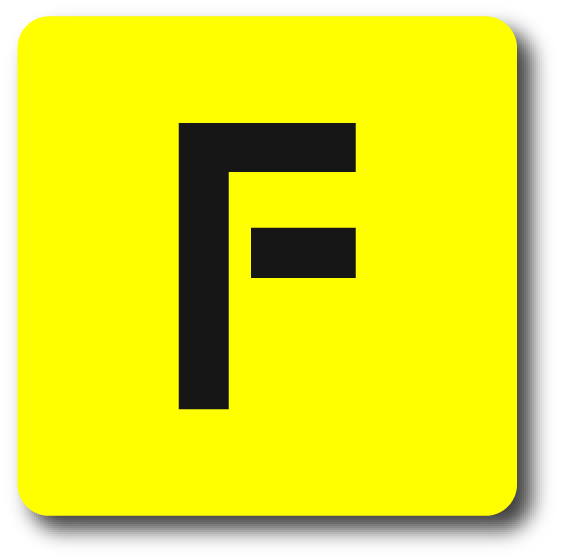

<h1 align="center" style="position: relative;">
    FadBot
</h1>

<h2 align="center" style="position: relative;">
    A Multipurpose Open-Source Bot in TypeScript
</h2>

# About The Project


FadBot is a multipurpose and open-source discord bot currently being developed using typescript. Currently, there's only one dev working on it, but I will try my best to frequently add more features.

Here are some things that you can expect from the bot:

* None of the main features of the bot will be put behind a paywall.
* Might have some fun minigames that you could play with your friends!
* Will implement some new features of the Discord API such as Context and Dropdown Menus, Buttons, Ephemeral Messages (and hopefully slash commands and threads).

## Built With
* [discord.js](https://github.com/discordjs/discord.js)
* typescript (using ts-node)

## Devs
* Fad The Chad

## Version
**Current Version:** v1.5.0

See `CHANGELOG.md` for all changes

## Trello
If you want to see some ideas/features that the bot could get, check out our [Trello Page](https://trello.com/b/4qiwoazB/fadbot-board)!

# Get Started

## Requirements
- Node `v16.6+` is required. You can install it at their [official site](https://nodejs.org/en/download/).

- `typescript` and `ts-node` is required. You can install it by doing
   ```shell
   npm i -g typescript ts-node
   ```

## Installation

1. Clone this repo

2. Install the NPM Packages
    ```shell
    npm install
    ```

3. Make a `config.json` file in the root of the directory and add:
    ```json
    "token": "Your Token Here",
    "prefix": "Your Prefix Here",
    "devs": ["devId1", "devId2"],
    "clientId": "Your Client ID Here",
    "guildId": "Your Guild ID Here",
    "mongoURI": "Your Mongodb Uri String Here"
    ```
   - `token` is the Bot's Token. You can receive it from Discord's Developer Portal.
   - `prefix` is the bot's prefix.
   - `devs` stores the ID of discord users that can run secret dev commands. You can add as many devs as you want, but It's recommended to keep it small.
   - `clientId` is your Client's ID. You can receive it from Discord's Developer Portal. [For Slash Cmds]
   - `guildId` is your Testing Guild/Server's ID. [For Slash Cmds]
   - `mongoURI` is the connection srv/local string of your mongoDB DB.

4. And finally, run the bot!
   ```shell
   ts-node .
   ```
# Contributing
Contributions are what make the open source community such an amazing place to learn, inspire, and create. Any contributions you make are greatly appreciated.

## Pull Requests

1. Fork the Project.

1. Create your Feature Branch (`git checkout -b feature/AmazingFeature`).

1. Commit your Changes (`git commit -m 'Add some AmazingFeature'`).

1. Push to the Branch (`git push origin feature/AmazingFeature`).

1. Open a pull request. We will review the changes (and hopefully merge it!).

Check out [`CONTRIBUTING.md`](https://github.com/FadTheChad/FadBot/blob/main/.github/CONTRIBUTING.md) before doing the above!

## Issues
Have a feature idea? Want to report a bug? Simply create an issue, and we will try to see what we can do!
Make sure to check both of our [Issue Templates](https://github.com/FadTheChad/FadBot/tree/main/.github/ISSUE_TEMPLATE) before you send one!

# Code Of Conduct
We expect you to be respectful with each other and create a happy environment! See [`CODE_OF_CONDUCT.md`](https://github.com/FadTheChad/FadBot/blob/main/.github/CODE_OF_CONDUCT.md) for more details!

# License
Distributed under the `GNU GPLv3` License. See [`LICENSE.txt`](https://github.com/FadTheChad/FadBot/blob/main/LICENSE.txt) for more information.

# Contact
Our Support Discord Server: https://discord.gg/3tEGymY5pE
